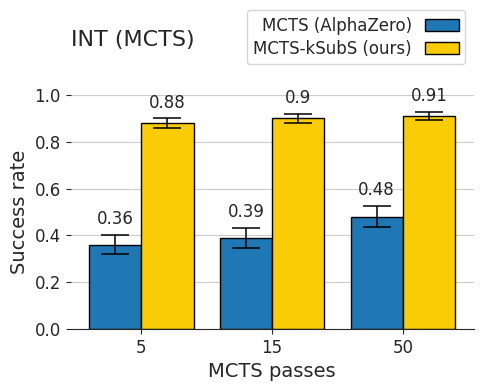
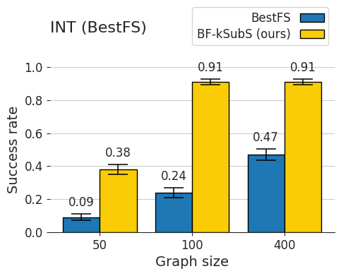
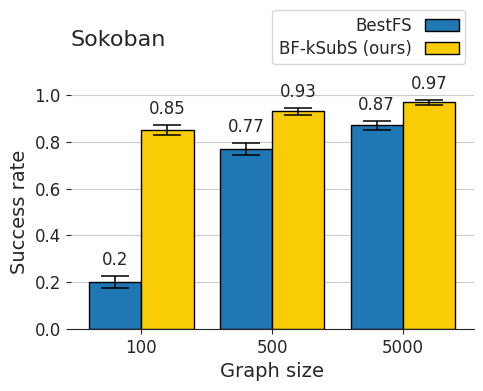
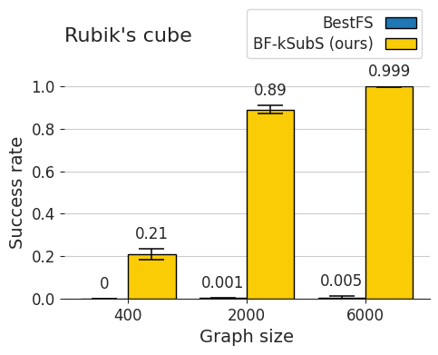

# Subgoal Search For Complex Reasoning Tasks

# Requirements

## Source code

Clone the repository:
```
git clone https://github.com/subgoal-search/subgoal-search.git
```
All commands from sections *Training* and *Evaluation* should be called from the root directory of the repository.

## Project resources

Download and unzip Google Drive directory containing all project resources:
[link](https://drive.google.com/drive/folders/1MmrUJ-lJSpDKMmGbLQfweBMn3izr_IxS?usp=sharing).
You can do it via Google's graphical interface or using [gdrive](https://github.com/prasmussen/gdrive) CLI tool.

It is recommended to set environmental variable `KSUBS_RESOURCES` to the path with unzipped directory:
```
export KSUBS_RESOURCES="/path/to/the/root/dir/of/resources"
```
which is frequently used in commands below (alternatively you may replace it on your own for each command separately).

Resources include:
* Singularity image
* Pretrained network checkpoints
* Datasets for Sokoban

## Dependencies

### Singularity (recommended)

Python interpreter and all required libraries are installed in the singularity image &ndash; `singularity_image.sif` file in resources directory. It is the easiest and recommended way of environment setup. [Singularity](https://sylabs.io/docs/) is a docker-like container platform, commonly supported in computing centers. You can also install it on your own machine if needed &ndash; see linked documentation. 

Alternatively, one can also build mentioned singularity image from scratch using `singularity.def` file from this repository (it may take a while - around 30-60 min).
```
sudo singularity build singularity_image.sif singularity.def
```

To run a command from *Training* or *Evaluation* section inside a singularity container, prepend the command with the following prefix:
```
singularity exec -B "${KSUBS_RESOURCES}" --nv "${KSUBS_RESOURCES}/singularity_image.sif"
```
So for example to run Rubik's Cube baseline evaluation, you need to run the following command:
```
singularity exec -B "${KSUBS_RESOURCES}" --nv "${KSUBS_RESOURCES}/singularity_image.sif" \
python3 runner.py \
--config_file="configs/rubik/solve/baseline.gin" \
--config="ValueEstimatorRubik.checkpoint_path=\"${KSUBS_RESOURCES}/rubik/rubik_value\"" \
--config="VanillaPolicyRubik.checkpoint_path=\"${KSUBS_RESOURCES}/rubik/rubik_vanilla_policy\""
```

### Virtualenv/conda (fall-back option)

If singularity is not an option in your computing setup, you may use classic virtualenv or conda environment instead. Just create environment with Python 3.6.9 and install required dependencies:
```
pip3 install -r requirements.txt -f https://download.pytorch.org/whl/torch_stable.html
```
Libraries and versions specified in `requirements.txt` match their counterparts from singularity image. Everything should work as with singularity image, but bear in mind that most of the commands were tested in singularity setup and virtualenv/conda setup is only a fall-back option.


# Training

To train models mentioned in the paper, one can use commands listed below.


## INT

### Proof length 5

Subgoal generator (k = 2) <br>
Requires: 16GB RAM, 1 GPU.
```
python3 runner.py \
--config_file="configs/int/train/proof_len_5/ksubs/subgoal_generator.gin"
```

Conditional policy (k = 2) <br>
Requires: 16GB RAM, 1 GPU.
```
python3 runner.py \
--config_file="configs/int/train/proof_len_5/ksubs/conditional_policy.gin"
```

Policy <br>
Requires: 16GB RAM, 1 GPU.
```
python3 runner.py \
--config_file="configs/int/train/proof_len_5/baseline/policy.gin"
```

Value network <br>
Requires: 16GB RAM, 1 GPU.
```
python3 runner.py \
--config_file="configs/int/train/proof_len_5/value.gin"
```


### Proof length 10

Subgoal generator (k = 3) <br>
Requires: 16GB RAM, 1 GPU.
```
python3 runner.py \
--config_file="configs/int/train/proof_len_10/ksubs/subgoal_generator.gin"
```

Conditional policy (k = 3) <br>
Requires: 16GB RAM, 1 GPU.
```
python3 runner.py \
--config_file="configs/int/train/proof_len_10/ksubs/conditional_policy.gin"
```

Policy <br>
Requires: 16GB RAM, 1 GPU.
```
python3 runner.py \
--config_file="configs/int/train/proof_len_10/baseline/policy.gin"
```

Value network <br>
Requires: 16GB RAM, 1 GPU.
```
python3 runner.py \
--config_file="configs/int/train/proof_len_10/value.gin"
```


### Proof length 15

Subgoal generator (k = 3) <br>
Requires: 16GB RAM, 1 GPU.
```
python3 runner.py \
--config_file="configs/int/train/proof_len_15/ksubs/subgoal_generator.gin"
```

Conditional policy (k = 3) <br>
Requires: 16GB RAM, 1 GPU.
```
python3 runner.py \
--config_file="configs/int/train/proof_len_15/ksubs/conditional_policy.gin"
```

Policy <br>
Requires: 16GB RAM, 1 GPU.
```
python3 runner.py \
--config_file="configs/int/train/proof_len_15/baseline/policy.gin"
```

Value network <br>
Requires: 16GB RAM, 1 GPU.
```
python3 runner.py \
--config_file="configs/int/train/proof_len_15/value.gin"
```


## Sokoban

Subgoal generator <br>
Requires: 120GB RAM, 28 CPU.

You can change size of board using `Sokoban.dim_room` parameter,
but remember to adjust `JobTrainSokobanPixelDiff.dataset` as well.

`k` is configurable with `JobTrainSokobanPixelDiff.steps_into_future` parameter.

```
python3 runner.py \
--config_file="configs/sokoban/train/subgoal_generator.gin" \
--config="JobTrainSokobanPixelDiff.dataset=\"${KSUBS_RESOURCES}/sokoban/datasets/12-12-4/\"" \
--config="JobTrainSokobanPixelDiff.steps_into_future=4" \
--config="Sokoban.dim_room=(12,12)"
```

Baseline policy <br>
Requires: 120GB RAM, 28 CPU.

You can change size of board `JobTrainSokobanPixelDiff.dataset`.

```
python3 runner.py \
--config_file="configs/sokoban/train/policy.gin" \
--config="JobSokobanTrainPolicyBaseline.dataset=\"${KSUBS_RESOURCES}/sokoban/datasets/12-12-4/\""
```


## Rubik's Cube

Subgoal generator (k = 4) <br>
Requires: 10GB RAM, 1 GPU.
```
python3 runner.py \
--config_file="configs/rubik/train/ksubs/subgoal_generator.gin"
```

Conditional policy (k = 4) <br>
Requires: 10GB RAM, 1 GPU.
```
python3 runner.py \
--config_file="configs/rubik/train/ksubs/conditional_policy.gin"
```

Policy <br>
Requires: 10GB RAM, 1 GPU.
```
python3 runner.py \
--config_file="configs/rubik/train/baseline/policy.gin"
```

Value network <br>
Requires: 10GB RAM, 1 GPU.
```
python3 runner.py \
--config_file="configs/rubik/train/value.gin"
```


# Evaluation


The following commands allow to run evaluation of kSubS and baselines presented in the paper. 
In our publication we evaluated each method on the 1000 randomly sampled problems. 
Here to allow faster execution, we set number of problems (`n_jobs`) to 5. 
To run a full evaluation and replicate results presented in the paper, remove the last line of each command in this section.

It is also recommended to redirect stdout and stderr to seperate files, as stderr contains much redundant information.

## INT: Table 2

### Proof length 5

BestFS (baseline) <br>
Requires: 6GB RAM, 1 GPU.

```
python3 runner.py \
--config_file="configs/int/solve/bfs/baseline.gin" \
--config="generate_problems.proof_length=5" \
--config="VanillaPolicyINT.checkpoint_path=\"${KSUBS_RESOURCES}/int/proof_len_5/int_len_5_vanilla_policy\"" \
--config="ValueEstimatorINT.checkpoint_path=\"${KSUBS_RESOURCES}/int/proof_len_5/int_len_5_value\"" \
--config="JobSolveINT.n_jobs=5"
```

BF-kSubS (k = 2) <br>
Requires: 6GB RAM, 1 GPU.

```
python3 runner.py \
--config_file="configs/int/solve/bfs/ksubs.gin" \
--config="generate_problems.proof_length=5" \
--config="GoalGeneratorINT.generator_checkpoint_path=\"${KSUBS_RESOURCES}/int/proof_len_5/int_len_5_generator_k_2\"" \
--config="ConditionalPolicyINT.checkpoint_path=\"${KSUBS_RESOURCES}/int/proof_len_5/int_len_5_conditional_policy_k_2\"" \
--config="ValueEstimatorINT.checkpoint_path=\"${KSUBS_RESOURCES}/int/proof_len_5/int_len_5_value\"" \
--config="JobSolveINT.n_jobs=5"
```

### Proof length 10

BestFS (baseline) <br>
Requires: 6GB RAM, 1 GPU.

```
python3 runner.py \
--config_file="configs/int/solve/bfs/baseline.gin" \
--config="generate_problems.proof_length=10" \
--config="VanillaPolicyINT.checkpoint_path=\"${KSUBS_RESOURCES}/int/proof_len_10/int_len_10_vanilla_policy\"" \
--config="ValueEstimatorINT.checkpoint_path=\"${KSUBS_RESOURCES}/int/proof_len_10/int_len_10_value\"" \
--config="JobSolveINT.n_jobs=5"
```

BF-kSubS (k = 3) <br>
Requires: 6GB RAM, 1 GPU.

```
python3 runner.py \
--config_file="configs/int/solve/bfs/ksubs.gin" \
--config="generate_problems.proof_length=10" \
--config="GoalGeneratorINT.generator_checkpoint_path=\"${KSUBS_RESOURCES}/int/proof_len_10/int_len_10_generator_k_3\"" \
--config="ConditionalPolicyINT.checkpoint_path=\"${KSUBS_RESOURCES}/int/proof_len_10/int_len_10_conditional_policy_k_3\"" \
--config="ValueEstimatorINT.checkpoint_path=\"${KSUBS_RESOURCES}/int/proof_len_10/int_len_10_value\""  \
--config="JobSolveINT.n_jobs=5"
```

### Proof length 15

BestFS (baseline) <br>
Requires: 6GB RAM, 1 GPU.

```
python3 runner.py \
--config_file="configs/int/solve/bfs/baseline.gin" \
--config="generate_problems.proof_length=15" \
--config="VanillaPolicyINT.checkpoint_path=\"${KSUBS_RESOURCES}/int/proof_len_15/int_len_15_vanilla_policy\"" \
--config="ValueEstimatorINT.checkpoint_path=\"${KSUBS_RESOURCES}/int/proof_len_15/int_len_15_value\""  \
--config="JobSolveINT.n_jobs=5"
```

BF-kSubS (k = 3) <br>
Requires: 6GB RAM, 1 GPU.

```
python3 runner.py \
--config_file="configs/int/solve/bfs/ksubs.gin" \
--config="generate_problems.proof_length=15" \
--config="GoalGeneratorINT.generator_checkpoint_path=\"${KSUBS_RESOURCES}/int/proof_len_15/int_len_15_generator_k_3\"" \
--config="ConditionalPolicyINT.checkpoint_path=\"${KSUBS_RESOURCES}/int/proof_len_15/int_len_15_conditional_policy_k_3\"" \
--config="ValueEstimatorINT.checkpoint_path=\"${KSUBS_RESOURCES}/int/proof_len_15/int_len_15_value\"" \
--config="JobSolveINT.n_jobs=5"
```

## INT: Figure 1

### BestFS

See commands in section *INT: Table 2, Proof length 15*.

### MCTS

Number of MCTS planning passes is configurable with parameter `StochasticMCTSAgent.n_passes`.

MCTS (AlphaZero) <br>
Requires: 6GB RAM, 1 GPU.
```
python3 runner.py \
--config_file="configs/int/solve/mcts/baseline.gin" \
--config="generate_problems.proof_length=15" \
--config="StochasticMCTSAgent.n_passes=5" \
--config="MCTSVanillaGoalBuilderInt.checkpoint_path=\"${KSUBS_RESOURCES}/int/proof_len_15/int_len_15_vanilla_policy\"" \
--config="JobMCTSSolveInt.value_estimator_checkpoint=\"${KSUBS_RESOURCES}/int/proof_len_15/int_len_15_value\"" \
--config="JobMCTSSolveInt.n_proofs=5"
```


MCTS-kSubS (k = 3) <br>
Requires: 6GB RAM, 1 GPU.
```
python3 runner.py \
--config_file="configs/int/solve/mcts/ksubs.gin" \
--config="generate_problems.proof_length=15" \
--config="StochasticMCTSAgent.n_passes=5" \
--config="GoalGeneratorINT.generator_checkpoint_path=\"${KSUBS_RESOURCES}/int/proof_len_15/int_len_15_generator_k_3\"" \
--config="ConditionalPolicyINT.checkpoint_path=\"${KSUBS_RESOURCES}/int/proof_len_15/int_len_15_conditional_policy_k_3\"" \
--config="JobMCTSSolveInt.value_estimator_checkpoint=\"${KSUBS_RESOURCES}/int/proof_len_15/int_len_15_value\"" \
--config="JobMCTSSolveInt.n_proofs=5"
```


## INT: Figure 3

To test generalization for longer proofs, run the following commands for different values of `generate_problems.proof_length` (lengths 10-14 in the paper).

BestFS <br>
Requires: 6GB RAM, 1 GPU.

```
python3 runner.py \
--config_file="configs/int/solve/bfs/baseline.gin" \
--config="generate_problems.proof_length=12" \
--config="VanillaPolicyINT.checkpoint_path=\"${KSUBS_RESOURCES}/int/proof_len_10/int_len_10_vanilla_policy\"" \
--config="ValueEstimatorINT.checkpoint_path=\"${KSUBS_RESOURCES}/int/proof_len_10/int_len_10_value\"" \
--config="JobSolveINT.n_jobs=5"
```

BF-kSubS (k = 3) <br>
Requires: 6GB RAM, 1 GPU.

```
python3 runner.py \
--config_file="configs/int/solve/bfs/ksubs.gin" \
--config="generate_problems.proof_length=12" \
--config="GoalGeneratorINT.generator_checkpoint_path=\"${KSUBS_RESOURCES}/int/proof_len_10/int_len_10_generator_k_3\"" \
--config="ConditionalPolicyINT.checkpoint_path=\"${KSUBS_RESOURCES}/int/proof_len_10/int_len_10_conditional_policy_k_3\"" \
--config="ValueEstimatorINT.checkpoint_path=\"${KSUBS_RESOURCES}/int/proof_len_10/int_len_10_value\"" \
--config="JobSolveINT.n_jobs=5"
```

## Sokoban: Figure 1, Figure 2, Table 3

BestFS <br>
Requires: 30GB RAM, 4 CPU.

```
python3 runner.py \
--config_file="configs/sokoban/solve/baseline.gin" \
--config="Sokoban.dim_room=(12,12)" \
--config="SokobanPolicyBaseline.model_id=\"${KSUBS_RESOURCES}/sokoban/policy/12-12-4\"" \
--config="ValueEstimator.model_id=\"${KSUBS_RESOURCES}/sokoban/value/12-12-4\""
```

BF-kSubS (k = 4) <br>
Requires: 30GB RAM, 4 CPU.

`BestFSSolverSokoban.max_steps` should be equal to 
`JobTrainSokobanPixelDiff.steps_into_future` (`k` parameter) used for subgoal generator training.

```
python3 runner.py \
--config_file="configs/sokoban/solve/ksubs.gin" \
--config="BestFSSolverSokoban.max_steps=4" \
--config="Sokoban.dim_room=(12,12)" \
--config="GoalPredictorPixelDiff.model_id=\"${KSUBS_RESOURCES}/sokoban/subgoal_generator/12-12-4\"" \
--config="ValueEstimator.model_id=\"${KSUBS_RESOURCES}/sokoban/value/12-12-4\""
```

For both BestFS and BF-kSubS evaluation you can change size of board using 
`Sokoban.dim_room` parameter, but remember to adjust checkpoint paths as well.

Note that these are single thread evaluations. They can be speed up by increasing 
`JobSolveSokoban.n_parallel_workers` and `JobSolveSokoban.batch_size` 
in gin configs, but this requires more RAM and CPU.

## Rubik's Cube: Figure 1.

BestFS <br>
Requires: 10GB RAM, 20 CPU.

```
python3 runner.py \
--config_file="configs/rubik/solve/baseline.gin" \
--config="ValueEstimatorRubik.checkpoint_path=\"${KSUBS_RESOURCES}/rubik/rubik_value\"" \
--config="VanillaPolicyRubik.checkpoint_path=\"${KSUBS_RESOURCES}/rubik/rubik_vanilla_policy\"" \
--config="JobSolveRubik.n_jobs=5"
```

BF-kSubS (k = 4) <br>
Requires: 10GB RAM, 20 CPU.

```
python3 runner.py \
--config_file="configs/rubik/solve/ksubs.gin" \
--config="GoalGeneratorRubik.generator_checkpoint_path=\"${KSUBS_RESOURCES}/rubik/rubik_generator_k_4\"" \
--config="ConditionalPolicyRubik.checkpoint_path=\"${KSUBS_RESOURCES}/rubik/rubik_conditional_policy_k_4\"" \
--config="ValueEstimatorRubik.checkpoint_path=\"${KSUBS_RESOURCES}/rubik/rubik_value\"" \
--config="JobSolveRubik.n_jobs=5"
```

# Pre-trained Models

You can find pretrained models for all commands from this README inside in the resources directory mentioned in *Requirements* section.

# Results

We present the main results below. For more results see the paper.

<p>


</p>

<p>


</p>

*Figure 1: The performance of Subgoal Search.*
* *(top, left) compared on INT (with the proof length 15) to AlphaZero.*
* *(top, right) BF-kSubS consistently achieves high performance, even for small computational budgets.*
* *(bottom, left) similarly on Sokoban (board size 12x12 with 4 boxes) the advantage of BF-kSubS is prominent for small budget.*
* *(bottom, right) BestFS fails to solve Rubik’s Cube.*
